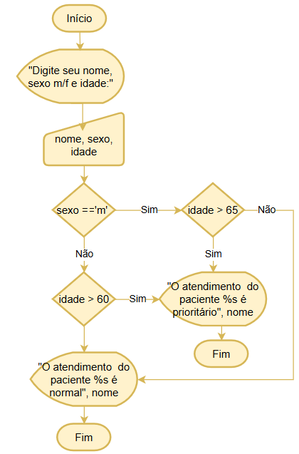

# 💠 VPS01 — Lógica de Programação

## 📚 Sobre o projeto

Este repositório foi desenvolvido durante a **Verificação Prática Somativa 01 (VPS01)**, com o objetivo de aplicar conhecimentos adquiridos nas aulas de **Lógica de Programação**.

Durante a atividade, foram utilizados conceitos de:

* 🧩 Algoritmos
* 💻 Linguagem C
* 🔀 Estruturas condicionais
* 🔢 Variáveis e tipos de dados
* 📊 Fluxogramas
* 📝 Portugol
* 🖥️ Desenvolvimento e execução de programas

---

# 📁 Estrutura do projeto

O repositório contém exercícios relacionados a situações práticas de programação:

```text
📂 Sesi_VPS01-LOP-2026
│
├── 📄 Atendimento.txt
├── 💻 atendimento.c
├── 🖼️ atendimento.png
│
├── 📄 Contagem.txt
├── 💻 Contagem.c
├── 🖼️ contagem.png
│
├── 📄 Triagem.txt
├── 💻 Triagem.c
├── 🖼️ triagem.png
│
├── ⚙️ Arquivos executáveis (.exe)
│
├── 📄 .gitignore
└── 📖 README.md
```

---

# 💡 Exercícios desenvolvidos

## 🏥 Atendimento

Programa desenvolvido para realizar uma verificação relacionada ao atendimento de pacientes.

O algoritmo recebe informações como:

* Nome
* Sexo
* Idade

A partir dessas informações, o programa utiliza estruturas condicionais para determinar se o atendimento será **prioritário ou normal**, de acordo com as condições estabelecidas no exercício.

---

## 🔢 Contagem

Exercício desenvolvido para trabalhar conceitos de:

* Variáveis
* Estruturas de repetição
* Contadores
* Algoritmos
* Fluxogramas

O objetivo é praticar a construção de programas utilizando lógica de programação para realizar processos de contagem.

---

## 🏥 Triagem

Exercício desenvolvido para aplicar conceitos de lógica de programação em uma situação de **triagem**.

Foram utilizados recursos como:

* Entrada de dados
* Processamento de informações
* Estruturas condicionais
* Tomada de decisões
* Fluxograma para representar a lógica do algoritmo

---

# 🛠️ Tecnologias utilizadas

| Tecnologia              | Utilização                                         |
| ----------------------- | -------------------------------------------------- |
| 💻 Linguagem C          | Desenvolvimento dos programas                      |
| 🖥️ Embarcadero Dev-C++ | Desenvolvimento e execução dos códigos             |
| 🔀 Draw.io              | Criação dos fluxogramas                            |
| 📝 Bloco de Notas       | Desenvolvimento de algoritmos e lógica em Portugol |
| 📂 GitHub               | Armazenamento e versionamento do projeto           |

---

# ▶️ Como executar o projeto

## 1️⃣ Clone o repositório

```bash
git clone https://github.com/giovanaremorini-dotcom/Sesi_VPS01-LOP-2026.git
```

---

## 2️⃣ Acesse a pasta do projeto

```bash
cd Sesi_VPS01-LOP-2026
```

---

## 3️⃣ Abra os arquivos

Abra os arquivos com extensão `.c` utilizando o **Embarcadero Dev-C++**.

Exemplo:

```text
atendimento.c
Contagem.c
Triagem.c
```

---

## 4️⃣ Compile e execute

No **Dev-C++**, utilize a opção de:

▶️ **Compilar e Executar**

Ou utilize o atalho configurado na IDE para executar o programa.

---

# 💻 Exemplo de código

```c
#include <stdio.h>
#include <windows.h>

void main() {

    SetConsoleOutputCP(CP_UTF8);

    char nome[20], sexo;
    int idade;

    printf("Digite seu nome, sexo m/f e idade\n");

    scanf(" %s %c %d", &nome, &sexo, &idade);

    if (sexo == 'm') {

        if (idade > 65) {

            printf("O atendimento do paciente %s é prioritário", nome);

        } else {

            printf("O atendimento do paciente %s é normal", nome);

        }

    } else {

        if (idade > 60) {

            printf("O atendimento do paciente %s é prioritário", nome);

        } else {

            printf("O atendimento do paciente %s é normal", nome);

        }
    }
}
```

---

# 🎯 Objetivo de aprendizagem

O principal objetivo deste projeto é desenvolver e demonstrar conhecimentos fundamentais em **Lógica de Programação**, utilizando problemas práticos para exercitar:

* 🧠 Raciocínio lógico;
* 📝 Construção de algoritmos;
* 🔀 Estruturas condicionais;
* 🔄 Estruturas de repetição;
* 💻 Programação em Linguagem C;
* 📊 Representação de algoritmos através de fluxogramas.

---

⭐ **Projeto desenvolvido para fins educacionais durante a VPS01 de Lógica de Programação — 2026.**

# VPS01
## Subtítulo descrição: Verificação Prática Somativa 01
Arquivos gerados durante a avaliação de lógica de programação, algoritimos e fluxogramas

## Tecnologias

|Tecnologia|Utilidade|
|:-:|-|
|Linguágem **C**|Desenvolvimento|
|IDE|Embarcadero **Dev C++**|
|[Draw.io](https://app.diagrams.net/)| Desenha os *fluxogramas*|
|Bloco de notas|*portugol* lógica|

## Como testar
- 1 clone este repositorio
- 2 abra os arquivos .c com o Dev C++
- 3 Precione F11 para compilar executar

## Exemplo de código
```c
#include<stdio.h>
#include<windows.h>
void main(){
	SetConsoleOutputCP(CP_UTF8);
	char nome[20], sexo;
	int idade;
	printf("Digite seu nome, sexo m/f e idade\n");
	scanf(" %s %c %d", &nome, &sexo, &idade);
	if(sexo == 'm'){
		if(idade > 65){
			printf("O atendimento do paciente %s é prioritário", nome);
  		}else{
		  	printf("O atendimento do paciente %s é normal", nome);
  		}
   }else{
      if(idade > 60){
	  	printf("O atendimento do paciente %s é prioritário", nome);
      }else{
      	printf("O atendimento do paciente %s é normal", nome);
	  }
    }
    getch();
}
```
.
